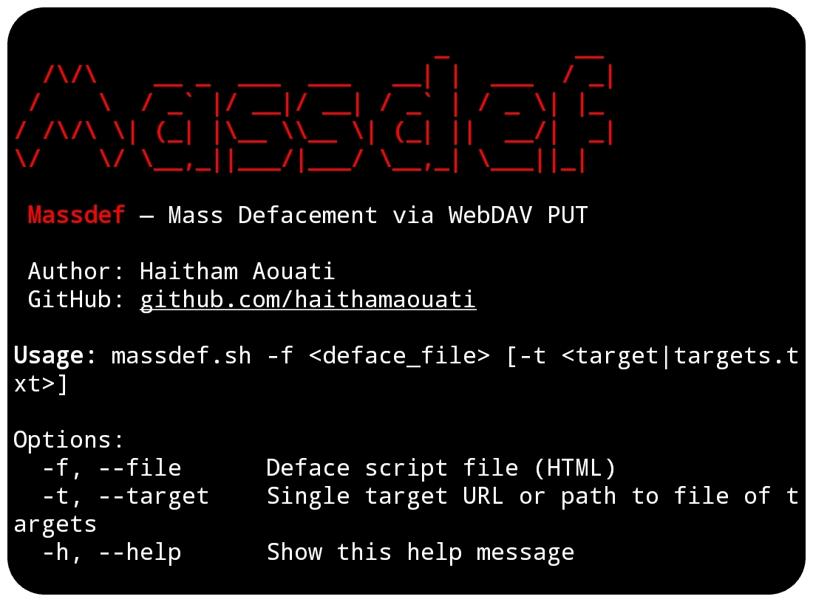

# Massdef

**Massdef** — Mass Defacement via WebDAV PUT



## Install

To use the Massdef script, follow these steps:

1. Clone the repository:

    ```
    git clone https://github.com/haithamaouati/Massdef.git
    ```

2. Change to the Massdef directory:

    ```
    cd Massdef
    ```
    
3. Change the file modes
    ```
    chmod +x massdef.sh
    ```
    
5. Run the script:

    ```
    ./massdef.sh
    ```

## Usage

Usage: `./massdef.sh -f <deface_file> [-t <target|targets.txt>]`

##### Options:

`-f`, `--file` Deface script file (HTML)

`-t`, `--target` Single target URL or path to file of targets

`-h`, `--help` Show this help message

## Dependencies

The script requires the following dependencies:

- **curl**: `pkg install curl - y`

Make sure to install these dependencies before running the script.

## Disclaimer
> [!WARNING]
> We are not responsible for any misuse or damage caused by this program. use this tool at your own risk!

## License

Massdef is licensed under [GLWTS license](LICENSE).
